# SportsCam Android Auto-Zoom Specification

## Overview
Android camera application that automatically zooms to maintain a constant subject size ("Virtual Dolly") during sports recording. Supports multiple sport modes: Basketball, Ski, and Hockey.

---

## Questions to Define Specification

**Q1: What is the primary use case for this app?**
✅ **Answer: Recording youth sports (basketball, ski, hockey)**

**Q2: Who will be operating the camera during the event?**
✅ **Answer: Parent/spectator with handheld camera. App helps parents record their kids during sports activities. Location varies by sport (stands for basketball/hockey, slope-side for skiing).**

**Q3: How should the auto-zoom behave?**
✅ **Answer (MVP): Virtual Dolly (Constant Subject Size)**
- Simple automatic zoom to capture the action
- No player selection needed (future feature)
- Focus on getting the core auto-zoom working first

**Q4: How does the parent select their kid at the start?**
✅ **Answer: Not needed for MVP - just record all active players**
(Future feature: tap to select, jersey number, etc.)

**Q5: How should the zoom transitions behave?**
✅ **Answer: Smooth gradual zoom (cinematic)**
- Pleasant viewing experience
- Avoids jarring camera movements
- Professional-looking output

**Q6: What Android devices should this support?**
✅ **Answer: Android 7.0+ (API 24)**
- Broad compatibility (7+ years of devices)
- No specific camera requirements (works with standard wide lens)
- Good balance of market coverage and performance

**Q7: What recording features are needed?**
✅ **Answer: Simple recording with manual override**
- Video recording with auto-zoom
- Manual zoom override using press-hold volume buttons
- Auto-save to Photos app
- One-click delete last video

**Q8: What performance is expected for real-time detection?**
✅ **Answer: Real-time with acceptable delay**
- Auto-zoom should work in real-time during recording
- 1 second delay is acceptable
- Must work on battery for full game (60+ minutes)
- Heating not a concern

**Q9: What should the UI show during recording?**
✅ **Answer: Informative recording UI**
- Camera preview with auto-zoom
- Show detected player bounding boxes
- Show recording time
- Start/Stop recording button
- Auto-zoom toggle button (re-enable after manual override)
- Auto-zoom disabled when volume buttons used for manual zoom

**Q10: How should the app detect players for auto-zoom?**
✅ **Answer: Use proven Python pipeline approach**
- YOLO model for player detection (convert to TensorFlow Lite)
- BBox activity detection to filter out refs/audience
- Port Python logic to Android (TFLite)
- Same accuracy and filtering as desktop version

**Q11: How should the LiDAR distance reading translate to zoom level?**
✅ **Answer: Constant Subject Size ("Virtual Dolly")**
- Assume player height = 6 feet (1.83m)
- Target size = 1/3 of screen height
- Adjust zoom dynamically based on distance to maintain this ratio

**Q12: Where should we measure the distance from?**
✅ **Answer: Center of Frame**
- Use the LiDAR depth reading at the center point of the screen
- Simpler implementation than tracking-based depth
- Requires user to keep subject centered (which they naturally do)

**Q13: Feasibility Check - LiDAR Range (~5m limit)**
✅ **Answer: Pivot to Vision-Based "Virtual Dolly"**
- Since LiDAR range is too short for court-side/stands recording, we will **NOT** use LiDAR.
- **New Logic**: Calculate the average bounding box height of active players.
- Adjust zoom so that this average height equals **1/3 of the screen height**.
- This achieves the "Constant Subject Size" effect using computer vision instead of distance sensors.

**Q14: Interaction - Zoom Modes**
✅ **Answer: Replace Old Logic (Option B)**
- The "Constant Subject Size" logic will **replace** the previous "Group Action" logic.
- We will no longer try to fit *all* players in the frame.
- Instead, we focus on maintaining the **average active player height at 33% (1/3) of screen height**.
- This creates a consistent viewing experience, treating the players as the fixed subject size.

---

## Complete Specification

### User Story
As a **parent** recording my child's sports activity, I want an **Android app that automatically zooms to keep active athletes in frame** so that **I can enjoy watching the event while getting professional-looking footage without manual camera adjustments**.

### Core Features (MVP)

#### 1. Auto-Zoom System
- **Athlete Detection**: YOLO model (TensorFlow Lite) running on-device
- **Activity Filtering**: BBox activity detector to filter static people (refs, audience, coaches, spectators)
- **Zoom Logic**: Maintain average active athlete height at 1/3 of screen height (Virtual Dolly)
- **Sport Modes**: Basketball, Ski, Hockey with optimized tracking parameters
- **Smooth Transitions**: Cinematic gradual zoom (not jarring)
- **Real-time Processing**: <1 second delay acceptable

#### 2. Recording Controls
#### 1. Auto-Zoom "Virtual Dolly"
- **Logic**: Calculate the **average height** of all "Active" athlete bounding boxes.
- **Target**: Adjust zoom so this average height occupies **33% (1/3) of the vertical screen height**.
- **Sport-Specific**: Different tracking parameters per sport mode (basketball: team play, ski: individual runs, hockey: fast movement)
- **Edge Case**: If no athletes are detected, **maintain (lock)** the current zoom level.
- **Smoothing**: Cinematic damping to avoid jitter.

#### 2. Detection & Filtering
- **Model**: YOLO (TensorFlow Lite)
- **Filtering**: `BBoxActivityDetector` to exclude static people (refs, bench, spectators)
- **Tracking**: `ByteTrack` for robust ID persistence across occlusions
- **Sport Modes**: Configurable track buffer (Basketball: 150 frames, Ski: 30 frames, Hockey: 100 frames)

#### 3. Recording Controls
- **Record**: One-tap recording to Photos.
- **Manual Override**: Volume buttons (+/-) allow temporary manual control.
- **Auto-Zoom Toggle**: Button to re-engage auto-mode after manual override.
- **Delete Last**: Trash button to quick-delete standard bad takes.

### 3.3 UI Components

#### 3.3.1 Debug Overlay (`DebugOverlay.kt`)
-   **Purpose**: Visual verification of computer vision pipeline.
-   **Design**: Dark semi-transparent card overlay (top-left or center-top) matching iOS design.
-   **Content**:
    -   **Status**: "AUTO ZOOM UNLOCKED/ACTIVE" (Green/Red text)
    -   **Metrics**:
        -   "Skier Height": Average normalized height of active player (0.00 - 1.00)
        -   "Zoom": Current zoom level (e.g., "1.00x") 
        -   "Analysis": Processing time in ms 
    -   **Controls**:
        -   "MODE": Toggle Sport Mode 
        -   "CONFIGURE PARAMS": Open params dialog 
        -   "DISABLE DEBUG MODE": Red Button to hide overlay
    -   **Activation**: Tap screen **5 times** quickly to toggle the debug overlay (hidden by default).
    -   **Visuals**: Also draws bounding boxes (Red for Raw, Green for Active) on the main view.

#### 3.3.2 Configuration Dialog (Future Feature)
-   **Purpose**: Fine-tune algorithm parameters per sport mode.
-   **UI**: Modal dialog triggered by "CONFIGURE PARAMS" button.
-   **Parameters**:
    -   **Target Definition**:
        -   *Target Height*: Slider (e.g., 15% - 50%).
    -   **PID Controller**:
        -   *Kp (Speed)*: Slider (e.g., 5.0).
        -   *Kd (Damping)*: Slider (e.g., 2.5).
    -   **Logic & Tracking**:
        -   *Max Missed Frames*: Integer stepper (e.g., 30).
        -   *Pan Smoothing Alpha*: Slider (e.g., 0.20).
    -   **Hysteresis (Deadband)**:
        -   *Start Threshold*: Slider (e.g., 15%).
        -   *Stop Threshold*: Slider (e.g., 5%).
    -   **Constraints**:
        -   *Max Zoom*: Stepper (e.g., 20x).
-   **Actions**: "Apply" to save, "Reset to Defaults" to restore.

#### 3.3.3 Main Screen Layout (`CameraScreen.kt`)

#### Main Screen
```
┌─────────────────────────────────┐
│  [AUTO: Virtual Dolly]     12:45│ <- Status / Time
│                                 │
│          ┌──────┐               │
│          │Player│               │
│          │      │               │ <- Player kept at 
│          │      │               │    ~1/3 Height
│          └──────┘               │
│                                 │
│  [Rec]   [Manual]    [Trash]    │
└─────────────────────────────────┘
```

**Q16: Zoom Smoothing - Kalman Filter Tuning**
✅ **Answer: Option B (Balanced)**
- Use a 1D Kalman Filter for zoom smoothing.
- Tune process noise (Q) and measurement noise (R) for a balance between stability and responsiveness.
- Eliminate "jitter" from frame-by-frame detection noise.

**Q17: Device Orientation Support**
✅ **Answer: Full Portrait & Landscape**
- The app must support recording in both **Portrait** and **Landscape** modes
- **UI Rotation**: The UI icons and text should rotate smoothly (90 degrees) when the device is turned, while the camera preview remains stable
- **Recording Orientation**: The video file should save with the correct orientation metadata based on how the device was held when recording started
- **Auto-Zoom Logic**: Must adapt to the aspect ratio. In Portrait, vertical tracking is more sensitive; in Landscape, horizontal field of view is wider. The "Virtual Dolly" target height (1/3 screen) applies to the vertical dimension in either orientation

**Q18: Zoom Oscillation Prevention**
✅ **Answer: Deadband / Hysteresis**
- Prevent "hunting" or "breathing" where zoom constantly adjusts for micro-movements.
- **Logic**: Only apply a new zoom target if it differs from the current zoom by **> 5%**.
- This ensures the camera stays locked until a meaningful change in subject distance occurs.

**Q19: Video Stabilization**
✅ **Answer: Enable Video Stabilization**
- Android provides video stabilization through CameraX
- **Requirement**: The app should enable stabilization mode to ensure smooth handheld footage
- **Note**: Stabilization slightly crops the field of view, so the auto-zoom logic must account for the *stabilized* FOV

### Technical Implementation

#### Auto-Zoom Algorithm
```python
1. Detect all people (YOLO)
2. Filter for "Active" (Movement/Pose)
3. If active_players > 0:
    avg_height_normalized = average(bbox.height for p in active_players)
    raw_target_zoom = 0.33 / avg_height_normalized
    
    # Kalman Filter Step
    filtered_zoom = kalman.predict_and_update(raw_target_zoom)
    
    set_zoom(filtered_zoom)
4. Else:
    maintain_current_zoom()
```

### Constraints
- **Max Zoom**: Cap at 5.0x (digital).
- **Min Zoom**: 1.0x (wide).

---

## Development Approach

### Phase 1: Core Detection (Week 1-2)
- Convert YOLO model to TensorFlow Lite
- Implement real-time inference with TFLite
- Test detection accuracy on Android device

### Phase 2: Activity Filtering (Week 3)
- Port bbox_activity_detector to Kotlin
- Integrate with detection pipeline
- Verify filtering works correctly

### Phase 3: Auto-Zoom Logic (Week 4)
- Calculate optimal zoom from player positions
- Implement smooth zoom transitions
- Test zoom behavior

### Phase 4: Recording UI (Week 5)
- Build camera preview with CameraX
- Add recording controls (Jetpack Compose)
- Implement manual override

### Phase 5: Polish & Testing (Week 6)
- Battery optimization
- UI refinements
- Real-world game testing
- Bug fixes

---

## Success Criteria

✅ **Functional**
- **Auto-zoom maintains constant subject size (1/3 height)**
- Filters out static refs/audience
- Smooth zoom transitions
- Manual override works
- Videos save to Photos

✅ **Performance**
- 15+ FPS detection speed
- 60+ minutes battery life
- No overheating
- <1 second zoom delay

✅ **User Experience**
- Simple one-tap recording
- Clear visual feedback
- Intuitive controls
- Professional-looking output

---

## Questions Answered

1. ✅ Primary use case: Recording youth basketball games
2. ✅ Operator: Parent in stands, handheld
3. ✅ Zoom behavior: Constant Subject Size (1/3 height)
4. ✅ Player selection: Not needed for MVP
5. ✅ Zoom transitions: Smooth gradual (cinematic)
6. ✅ Device support: iPhone 13+
7. ✅ Recording features: Auto-zoom, manual override, auto-save, quick delete
8. ✅ Performance: Real-time, 1s delay OK, 60+ min battery
9. ✅ UI: Bounding boxes, time, controls, auto-zoom toggle
10. ✅ Detection: YOLO + bbox activity (same as Python)

---

## Ready for Development!

This specification provides a complete blueprint for building the SportsCam Android auto-zoom app. All key decisions have been made, and the scope is well-defined for an MVP that delivers real value to parents recording youth sports activities (basketball, ski, hockey).

---

## Auto-Zoom Algorithm Execution Flow

> [!NOTE]
> This algorithm implements a **Critically Damped PID Controller** treating zoom as a physical system with "mass" and "friction" to ensure smooth, overshoot-free transitions.

### Execution Pipeline

The auto-zoom system consists of 10 sequential steps, each handled by a specific component:

| Step | Action | Primary Class | Helper / Dependency | Basketball | Ski | Hockey | Description |
| :--- | :--- | :--- | :--- | :--- | :--- | :--- | :--- |
| **1** | Service Entry | `FrameThrottler` | `AutoZoomService` | `interval=1` | `interval=1` | `interval=1` | Validates frame and applies throttling |
| **2** | Detection | `YOLODetector` | `TFLite`, `GPU Delegate` | `conf>0.4` | `conf>0.2` | `conf>0.4` | Runs YOLO TFLite model |
| **3** | Tracking | `ByteTrackTracker` | `KalmanFilter`, `IoU` | `buffer=150` | `buffer=30` | `buffer=100` | Assigns persistent IDs |
| **4** | Selection | `AthleteSelection` | `Track` | `maxMissed=10` | `maxMissed=30` | `maxMissed=15` | Filters active athletes |
| **5** | Activity Filter | `BBoxActivityDetector` | `Movement History` | `threshold=0.05` | `threshold=0.08` | `threshold=0.06` | Removes static people |
| **6** | Error Calculation | `TargetZoomCalc` | - | `targetHeight=0.33` | `targetHeight=0.33` | `targetHeight=0.33` | Computes size delta |
| **7** | Hysteresis | `HysteresisGate` | - | `Start>0.10, Stop<0.05` | `Start>0.15, Stop<0.05` | `Start>0.10, Stop<0.05` | Deadband logic |
| **8** | PID Control | `PIDController` | - | `Kp=6.0, Kd=3.0` | `Kp=5.0, Kd=2.5` | `Kp=6.5, Kd=3.2` | Calculates smooth velocity |
| **9** | Physics Scaling | `ZoomLogScaling` | - | `kZoom=15.0` | `kZoom=10.0` | `kZoom=12.0` | Linear→Log velocity |
| **10** | Constraints | `ZoomConstraint` | - | `max=3.0x` | `max=20x` | `max=5.0x` | Clamps final zoom |
| **11** | Hardware Apply | `ZoomHardwareActuator` | `CameraX` | `rampRate=4.0` | `rampRate=2.0` | `rampRate=3.5` | Sets zoom via CameraControl |

### Debugging & Traceability
Each stage in the pipeline **must** emit a debug log (`Log.d`) with value details to facilitate troubleshooting.
- **Tag:** "AutoZoom"
- **Required trace points:**
    1.  **Entry**: "Processing N active players. CurrentZoom: X.X"
    2.  **Error**: "Error: X.XXX (TargetRatio: Y.Y)"
    3.  **Hysteresis**: "Hysteresis Gate: BLOCKED/PASSED (Error X.XXX)"
    4.  **PID**: "PID Output: Velocity=X.X"
    5.  **Constraints**: "Constrained: Limit hit / Safe"
    6.  **Apply**: "APPLYING ZOOM: X.X (Velocity: Y.Y, Error: Z.Z)"

### Architectural Diagram

```mermaid
graph LR
    A(Camera Input) --> B1(Detection)
    B1 -->|Raw List| B2(Tracking)
    B2 -->|Tracks| B3(Selection)
    B3 -->|Active| B4(Activity Filter)
    B4 -->|Filtered| T(Target Calc)
    T -->|Raw Error| H(Hysteresis Gate)
    H -->|Active Error| D(PID Controller)
    D -->|Linear Velocity| L(Log Scaling)
    L -->|Log Velocity| E(Constraint)
    E -->|Safe Zoom| F(Hardware Actuator)
    
    subgraph "1. Perception"
    B1
    B2
    B3
    B4
    T
    H
    end
    
    subgraph "2. Control"
    D
    L
    end
    
    subgraph "3. Safety"
    E
    F
    end
```



### Component Details

#### 1. AutoZoomService
**Purpose:** Main orchestrator for the auto-zoom pipeline

**API:**
```kotlin
class AutoZoomService(
    private val detector: YOLODetector,
    private val tracker: ByteTrackTracker,
    private val activityDetector: BBoxActivityDetector,
    private val targetZoomCalc: TargetZoomCalc,
    private val hysteresisGate: HysteresisGate,
    private val pidController: PIDController,
    private val zoomScaling: ZoomLogScaling,
    private val zoomConstraint: ZoomConstraint,
    private val hardwareActuator: ZoomHardwareActuator
) {
    fun processFrame(imageProxy: ImageProxy, sportMode: SportMode)
    fun reset()
}
```

#### 2. FrameThrottler
**Purpose:** Frame validation and throttling

**API:**
```kotlin
class FrameThrottler(
    private val interval: Int = 1  // Process every Nth frame
) {
    fun shouldProcess(frameNumber: Long): Boolean
}
```

#### 3. TargetZoomCalc
**Purpose:** Calculate zoom error from target size

**API:**
```kotlin
class TargetZoomCalc {
    fun calculateError(
        activeTracks: List<Track>,
        frameSize: Size,
        targetHeightRatio: Float = 0.33f
    ): Float {
        if (activeTracks.isEmpty()) return 0f
        
        val avgHeight = activeTracks.map { it.bbox.height() }.average()
        val currentScale = avgHeight
        val targetScale = targetHeightRatio
        
        return targetScale - currentScale  // Raw error
    }
}
```

#### 4. PIDController
**Purpose:** Critically damped PD controller for smooth zoom

**API:**
```kotlin
class PIDController(
    private var kp: Float = 6.0f,      // Proportional gain
    private var kd: Float = 3.0f       // Derivative gain (kd = 2*sqrt(kp) for critical damping)
) {
    private var lastError: Float = 0f
    private var lastTime: Long = 0L
    
    fun calculate(error: Float, currentTime: Long): Float {
        val dt = (currentTime - lastTime) / 1000f  // Convert to seconds
        if (dt <= 0) return 0f
        
        val derivative = (error - lastError) / dt
        val velocity = kp * error + kd * derivative
        
        lastError = error
        lastTime = currentTime
        
        return velocity
    }
    
    fun updateGains(kp: Float, kd: Float) {
        this.kp = kp
        this.kd = kd
    }
    
    fun reset() {
        lastError = 0f
        lastTime = 0L
    }
}
```

#### 5. ZoomLogScaling
**Purpose:** Convert linear velocity to logarithmic scale

**API:**
```kotlin
class ZoomLogScaling(
    private var kZoom: Float = 15.0f
) {
    fun scale(linearVelocity: Float, currentZoom: Float): Float {
        // Multiply by current zoom for logarithmic perception
        return linearVelocity * kZoom * currentZoom
    }
    
    fun updateGain(kZoom: Float) {
        this.kZoom = kZoom
    }
}
```

**Rationale:** Human perception is logarithmic. A change from 1x→2x should feel identical to 10x→20x.

#### 6. ZoomConstraint
**Purpose:** Safety limits for zoom level

**API:**
```kotlin
class ZoomConstraint(
    private var minZoom: Float = 1.0f,
    private var maxZoom: Float = 3.0f,
    private var maxVelocity: Float = 2.0f  // Max zoom change per second
) {
    fun constrain(targetZoom: Float, currentZoom: Float, dt: Float): Float {
        // Rate limiting
        val maxChange = maxVelocity * dt
        val clampedZoom = (targetZoom - currentZoom).coerceIn(-maxChange, maxChange) + currentZoom
        
        // Zoom range limiting
        return clampedZoom.coerceIn(minZoom, maxZoom)
    }
    
    fun updateLimits(minZoom: Float, maxZoom: Float, maxVelocity: Float) {
        this.minZoom = minZoom
        this.maxZoom = maxZoom
        this.maxVelocity = maxVelocity
    }
}
```

#### 7. PanSmoother
**Purpose:** Low-pass filter (EMA) for pan smoothing

**API:**
```kotlin
class PanSmoother(
    private val alpha: Float = 0.2f  // Smoothing factor
) {
    private var smoothedX: Float = 0.5f
    private var smoothedY: Float = 0.5f
    
    fun smooth(centerX: Float, centerY: Float): Pair<Float, Float> {
        smoothedX = alpha * centerX + (1 - alpha) * smoothedX
        smoothedY = alpha * centerY + (1 - alpha) * smoothedY
        return Pair(smoothedX, smoothedY)
    }
    
    fun reset() {
        smoothedX = 0.5f
        smoothedY = 0.5f
    }
}
```

**Note:** Currently inactive for hardware zoom (center-locked), but available for digital crop.

#### 8. ZoomHardwareActuator
**Purpose:** Apply zoom to camera hardware

**API:**
```kotlin
class ZoomHardwareActuator(
    private val camera: Camera,
    private var rampRate: Float = 4.0f
) {
    fun applyZoom(targetZoom: Float) {
        camera.cameraControl.setLinearZoom(
            (targetZoom - 1.0f) / (camera.cameraInfo.zoomState.value?.maxZoomRatio ?: 3.0f - 1.0f)
        )
    }
    
    fun updateRampRate(rampRate: Float) {
        this.rampRate = rampRate
    }
}
```

### Sport-Specific Parameter Summary

| Parameter | Basketball | Ski | Hockey | Purpose |
|-----------|-----------|-----|--------|---------|
| **Track Buffer** | 150 frames | 30 frames | 100 frames | Occlusion tolerance |
| **Movement Threshold** | 0.05 | 0.08 | 0.06 | Activity detection |
| **Confidence** | >0.4 | >0.2 | >0.4 | Detection threshold |
| **Max Missed** | 10 frames | 30 frames | 15 frames | Track persistence |
| **Hysteresis Start** | >0.10 | >0.15 | >0.10 | Zoom activation |
| **Hysteresis Stop** | <0.05 | <0.05 | <0.05 | Zoom deactivation |
| **Kp (Proportional)** | 6.0 | 5.0 | 6.5 | Reaction speed |
| **Kd (Derivative)** | 3.0 | 2.5 | 3.2 | Damping |
| **kZoom** | 15.0 | 10.0 | 12.0 | Zoom gain |
| **Max Zoom** | 3.0x | 20x | 5.0x | Zoom limit |
| **Ramp Rate** | 4.0 | 2.0 | 3.5 | Zoom speed |

---

## Detailed Specification

### 1. Data Models

#### 1.1 Detection
```kotlin
data class Detection(
    val bbox: RectF,           // Bounding box (normalized 0-1)
    val confidence: Float,      // Detection confidence 0-1
    val classId: Int,          // Object class ID (0 = person)
    val trackId: Int = -1      // Assigned by tracker
)
```

#### 1.2 Track
```kotlin
data class Track(
    val id: Int,               // Unique track ID
    val bbox: RectF,           // Current bounding box
    val confidence: Float,      // Track confidence
    val age: Int = 0,          // Frames since creation
    val hits: Int = 0,         // Successful matches
    val misses: Int = 0,       // Missed detections
    val isActive: Boolean = false,  // Movement detected
    val state: TrackState = TrackState.TENTATIVE
)

enum class TrackState {
    TENTATIVE,  // New track, not confirmed
    CONFIRMED,  // Stable track
    LOST        // Track lost, in buffer
}
```

#### 1.3 ZoomState
```kotlin
data class ZoomState(
    val currentZoom: Float,     // Current zoom ratio (1.0 - 5.0)
    val targetZoom: Float,      // Target zoom ratio
    val isAutoZoom: Boolean,    // Auto-zoom enabled
    val mode: ZoomMode
)

enum class ZoomMode {
    AUTO,       // Auto-zoom tracking
    MANUAL,     // Manual control
    LOCKED      // Zoom locked
}
```

#### 1.4 CameraState
```kotlin
data class CameraState(
    val isRecording: Boolean = false,
    val recordingDuration: Long = 0L,  // Milliseconds
    val zoomState: ZoomState,
    val fps: Float = 0f,
    val showDebug: Boolean = false,
    val sportMode: SportMode = SportMode.BASKETBALL,
    val modelType: String = "YOLOv8n-INT8" // Optimized for Pixel 10 NPU
)
```

#### 1.5 SportMode
```kotlin
enum class SportMode(
    val displayName: String,
    val trackBuffer: Int,          // Frames to keep lost tracks
    val minConfidence: Float,      // Minimum detection confidence
    val targetFrameRatio: Float,   // Target size as ratio of frame
    val movementThreshold: Float   // Activity detection threshold
) {
    BASKETBALL(
        displayName = "Basketball",
        trackBuffer = 150,         // Long occlusions (players overlap)
        minConfidence = 0.5f,
        targetFrameRatio = 0.33f,  // 1/3 of screen
        movementThreshold = 0.05f  // Moderate movement
    ),
    SKI(
        displayName = "Ski",
        trackBuffer = 30,          // Short occlusions (individual runs)
        minConfidence = 0.5f,
        targetFrameRatio = 0.33f,
        movementThreshold = 0.08f  // Higher threshold (background motion)
    ),
    HOCKEY(
        displayName = "Hockey",
        trackBuffer = 100,         // Medium occlusions (fast movement)
        minConfidence = 0.5f,
        targetFrameRatio = 0.33f,
        movementThreshold = 0.06f  // Fast movement
    )
}
```


---

### 2. Component Specifications

#### 2.1 YOLODetector

**Purpose:** Run YOLO inference on camera frames and filter for target athletes.

**API:**
```kotlin
class YOLODetector(
    private val context: Context,
    private val modelPath: String = "yolo.tflite"
) {
    fun detect(bitmap: Bitmap): List<Detection>
    fun close()
    
    companion object {
        const val INPUT_SIZE = 640
        const val PERSON_CLASS_ID = 0
    }
}
```

**Responsibilities:**
- **Robust TFLite Parsing**: Automatically detects memory layout ([features, anchors] vs [anchors, features]) to handle both standard and transposed model exports.
- **Coordinate Formatting**: Autodetects if the model outputs Corner (LTRB) or Center (CXCYWH) coordinates based on value distribution.
- **Strict Person Filtering**: Only returns detections where the argmax of class probabilities corresponds to Class 0 (Person).
- **Inference with GPU**: Uses `GpuDelegate` for high-performance hardware acceleration where supported.
- **Normalization**: Scales bounding box coordinates to 0.0-1.0 range regardless of internal model input size (e.g. 640px).

**Performance Requirements:**
- Inference time: < 50ms on mid-range device.
- Memory usage: < 50MB.
- Layout-agnostic parsing adds negligible overhead.

---

#### 2.2 BBoxActivityDetector

**Purpose:** Filter static people (refs, audience) from active players

**API:**
```kotlin
class BBoxActivityDetector(
    private val movementThreshold: Float = 0.05f,  // 5% of frame
    private val historySize: Int = 10              // Frames to track
) {
    fun isActive(track: Track, history: List<RectF>): Boolean
    
    private fun calculateMovement(bbox1: RectF, bbox2: RectF): Float
}
```

**Algorithm:**
```kotlin
// Calculate movement over last N frames
val recentBboxes = history.takeLast(historySize)
val totalMovement = recentBboxes.zipWithNext { a, b ->
    calculateMovement(a, b)
}.sum()

return totalMovement > movementThreshold
```

---

#### 2.3 SimpleTracker / ByteTrackTracker

**Purpose:** Multi-object tracking with ID persistence

**API:**
```kotlin
class ByteTrackTracker(
    private val trackThresh: Float = 0.5f,
    private val trackBuffer: Int = 30,
    private val matchThresh: Float = 0.8f
) {
    fun update(detections: List<Detection>): List<Track>
    fun reset()
    
    private fun matchDetectionsToTracks(
        detections: List<Detection>,
        tracks: List<Track>
    ): List<Pair<Detection, Track>>
    
    private fun calculateIoU(bbox1: RectF, bbox2: RectF): Float
}
```

---

#### 2.4 KalmanFilter

**Purpose:** Smooth zoom predictions

**API:**
```kotlin
class KalmanFilter1D(
    private val processNoise: Float = 0.01f,  // Q
    private val measurementNoise: Float = 0.1f // R
) {
    private var state: Float = 1.0f
    private var covariance: Float = 1.0f
    
    fun predict(): Float
    fun update(measurement: Float): Float
    fun reset()
}
```

**Usage:**
```kotlin
val kalman = KalmanFilter1D()
val rawZoom = calculateRawZoom(activePlayers)
val smoothedZoom = kalman.update(rawZoom)
```

---

#### 2.5 ZoomController

**Purpose:** Calculate and apply camera zoom

**API:**
```kotlin
class ZoomController(
    private val camera: Camera,
    private val kalmanFilter: KalmanFilter1D,
    private val hysteresisGate: HysteresisGate
) {
    fun calculateTargetZoom(
        activePlayers: List<Track>,
        frameSize: Size,
        targetRatio: Float = 0.33f  // 1/3 of screen
    ): Float
    
    fun applyZoom(targetZoom: Float)
    
    fun setManualZoom(zoomRatio: Float)
}
```

**Zoom Calculation:**
```kotlin
// Calculate average height of active players
val avgHeight = activePlayers.map { it.bbox.height() }.average()

// Target: avgHeight = targetRatio * frameHeight
// So: zoom = targetRatio / avgHeight
val rawTargetZoom = targetRatio / avgHeight

// Apply Kalman smoothing
val smoothedZoom = kalmanFilter.update(rawTargetZoom)

// Apply hysteresis gate
if (hysteresisGate.shouldUpdate(smoothedZoom - currentZoom)) {
    val finalZoom = smoothedZoom.coerceIn(1.0f, 5.0f)
    camera.cameraControl.setZoomRatio(finalZoom)
}
```

---

#### 2.6 HysteresisGate

**Purpose:** Prevent zoom jitter

**API:**
```kotlin
class HysteresisGate(
    private val lowThreshold: Float = 0.05f,   // 5% change
    private val highThreshold: Float = 0.15f   // 15% change
) {
    private var isActive = false
    
    fun shouldUpdate(change: Float): Boolean {
        return when {
            abs(change) > highThreshold -> {
                isActive = true
                true
            }
            abs(change) < lowThreshold -> {
                isActive = false
                false
            }
            else -> isActive
        }
    }
}
```

---

#### 2.7 VolumeButtonHandler

**Purpose:** Handle volume button controls

**API:**
```kotlin
class VolumeButtonHandler(
    private val onVolumeDown: () -> Unit,
    private val onVolumeUp: () -> Unit,
    private val onDoubleClick: () -> Unit
) {
    private var lastPressTime = 0L
    private val doubleClickWindow = 400L  // ms
    
    fun onKeyDown(keyCode: Int): Boolean
    fun onKeyUp(keyCode: Int): Boolean
}
```

**Controls:**
- Volume Down (hold): Zoom out
- Volume Up (hold): Zoom in
- Double-click either: Start/stop recording

---

#### 2.8 CameraManager

**Purpose:** Manage CameraX lifecycle

**API:**
```kotlin
class CameraManager(
    private val context: Context,
    private val lifecycleOwner: LifecycleOwner
) {
    fun startCamera(
        previewView: PreviewView,
        onFrameAnalyzed: (ImageProxy) -> Unit
    )
    
    fun stopCamera()
    
    fun setZoom(zoomRatio: Float)
    
    fun startRecording(
        onRecordingStarted: () -> Unit,
        onRecordingFinished: (Uri) -> Unit,
        onError: (String) -> Unit
    )
    
    fun stopRecording()
}
```

---

### 3. ViewModel Specifications

#### 3.1 CameraViewModel

**Purpose:** Main UI state management

**State:**
```kotlin
class CameraViewModel(
    private val cameraManager: CameraManager,
    private val yoloDetector: YOLODetector,
    private val activityDetector: BBoxActivityDetector,
    private val tracker: ByteTrackTracker,
    private val zoomController: ZoomController
) : ViewModel() {
    
    // State
    private val _cameraState = MutableStateFlow(CameraState(...))
    val cameraState: StateFlow<CameraState> = _cameraState.asStateFlow()
    
    // Actions
    fun startCamera(context: Context, lifecycleOwner: LifecycleOwner, previewView: PreviewView)
    fun stopCamera()
    fun toggleRecording()
    fun setManualZoom(delta: Float)
    fun enableAutoZoom()
    fun toggleDebugOverlay()
    fun setSportMode(mode: SportMode) {
        _cameraState.update { it.copy(sportMode = mode) }
        // Update tracker with new sport mode parameters
        tracker.updateConfig(
            trackBuffer = mode.trackBuffer,
            minConfidence = mode.minConfidence
        )
        // Update activity detector
        activityDetector.updateThreshold(mode.movementThreshold)
    }
    
    // Frame processing
    private fun processFrame(imageProxy: ImageProxy) {
        val currentMode = cameraState.value.sportMode
        
        // 1. Detect people
        val detections = yoloDetector.detect(imageProxy.toBitmap())
        
        // 2. Update tracks (using sport-specific parameters)
        val tracks = tracker.update(detections)
        
        // 3. Filter for active players (using sport-specific threshold)
        val activePlayers = tracks.filter { track ->
            activityDetector.isActive(track, trackHistory[track.id])
        }
        
        // 4. Calculate zoom (using sport-specific target ratio)
        if (cameraState.value.zoomState.isAutoZoom && activePlayers.isNotEmpty()) {
            val targetZoom = zoomController.calculateTargetZoom(
                activePlayers,
                imageProxy.size,
                targetRatio = currentMode.targetFrameRatio
            )
            zoomController.applyZoom(targetZoom)
        }
        
        // 5. Update UI state
        _cameraState.update { it.copy(
            detections = detections,
            activePlayers = activePlayers
        )}
    }
}
```

---

### 4. UI Specifications

#### 4.1 CameraScreen

**Composable:**
```kotlin
@Composable
fun CameraScreen(
    viewModel: CameraViewModel = viewModel()
) {
    val state by viewModel.cameraState.collectAsState()
    
    Box(Modifier.fillMaxSize()) {
        // Camera preview
        AndroidView(
            factory = { ctx ->
                PreviewView(ctx).apply {
                    implementationMode = PreviewView.ImplementationMode.COMPATIBLE
                }
            },
            modifier = Modifier.fillMaxSize()
        ) { previewView ->
            LaunchedEffect(Unit) {
                viewModel.startCamera(LocalContext.current, LocalLifecycleOwner.current, previewView)
            }
        }
        
        // Status bar
        StatusBar(
            zoomState = state.zoomState,
            recordingDuration = state.recordingDuration,
            modifier = Modifier.align(Alignment.TopCenter)
        )
        
        // Debug overlay
        if (state.showDebug) {
            DebugOverlay(
                detections = state.detections,
                activePlayers = state.activePlayers,
                fps = state.fps
            )
        }
        
        // Sport mode selector (top-left)
        if (!state.isRecording) {
            SportModeSelector(
                currentMode = state.sportMode,
                onModeSelected = { viewModel.setSportMode(it) },
                modifier = Modifier
                    .align(Alignment.TopStart)
                    .padding(16.dp)
            )
        }
        
        // Control buttons
        Row(
            modifier = Modifier
                .align(Alignment.BottomCenter)
                .padding(32.dp),
            horizontalArrangement = Arrangement.spacedBy(32.dp)
        ) {
            // Record button
            RecordButton(
                isRecording = state.isRecording,
                onClick = { viewModel.toggleRecording() }
            )
            
            // Manual zoom toggle
            IconButton(onClick = { viewModel.enableAutoZoom() }) {
                Icon(Icons.Default.ZoomIn, "Manual Zoom")
            }
            
            // Delete last (if not recording)
            if (!state.isRecording) {
                IconButton(onClick = { /* Delete last video */ }) {
                    Icon(Icons.Default.Delete, "Delete Last")
                }
            }
        }
    }
}
```

#### 4.2 StatusBar

```kotlin
@Composable
fun StatusBar(
    zoomState: ZoomState,
    recordingDuration: Long,
    modifier: Modifier = Modifier
) {
    Row(
        modifier = modifier
            .fillMaxWidth()
            .background(Color.Black.copy(alpha = 0.5f))
            .padding(16.dp),
        horizontalArrangement = Arrangement.SpaceBetween
    ) {
        // Auto-zoom status
        Text(
            text = when (zoomState.mode) {
                ZoomMode.AUTO -> "AUTO: Virtual Dolly"
                ZoomMode.MANUAL -> "MANUAL"
                ZoomMode.LOCKED -> "LOCKED"
            },
            color = Color.White
        )
        
        // Recording time
        if (recordingDuration > 0) {
            Text(
                text = formatDuration(recordingDuration),
                color = Color.Red
            )
        }
    }
}
```

#### 4.3 SportModeSelector

```kotlin
@Composable
fun SportModeSelector(
    currentMode: SportMode,
    onModeSelected: (SportMode) -> Unit,
    modifier: Modifier = Modifier
) {
    var expanded by remember { mutableStateOf(false) }
    
    Box(modifier = modifier) {
        // Current mode button
        Button(
            onClick = { expanded = true },
            colors = ButtonDefaults.buttonColors(
                containerColor = Color.Black.copy(alpha = 0.7f)
            )
        ) {
            Icon(Icons.Default.Sports, "Sport Mode")
            Spacer(Modifier.width(8.dp))
            Text(currentMode.displayName)
        }
        
        // Dropdown menu
        DropdownMenu(
            expanded = expanded,
            onDismissRequest = { expanded = false }
        ) {
            SportMode.values().forEach { mode ->
                DropdownMenuItem(
                    text = { Text(mode.displayName) },
                    onClick = {
                        onModeSelected(mode)
                        expanded = false
                    },
                    leadingIcon = {
                        if (mode == currentMode) {
                            Icon(Icons.Default.Check, "Selected")
                        }
                    }
                )
            }
        }
    }
}
```

---

### 5. Performance Specifications

#### 5.1 Frame Processing Pipeline

**Target Performance:**
- Camera preview: 30 FPS
- Detection inference: 10 FPS (process every 3rd frame)
- Tracking update: 30 FPS
- Zoom update: 30 FPS

**Threading:**
```
Main Thread:     UI rendering, user input
Camera Thread:   Frame capture
Analysis Thread: YOLO inference
Tracking Thread: Track updates, zoom calculation
```

#### 5.2 Memory Budget

| Component | Budget |
|-----------|--------|
| YOLO Model | 10 MB |
| Frame Buffers | 20 MB |
| Track History | 5 MB |
| UI State | 5 MB |
| **Total** | **< 50 MB** |

#### 5.3 Battery Optimization

**Strategies:**
- Throttle detection to 10 FPS
- Use GPU delegate for ML
- Release resources when app backgrounded
- Optimize frame processing pipeline

---

### 6. Testing Specifications

#### 6.1 Unit Tests

**Coverage Targets:**
- Tracking algorithms: 90%
- Zoom calculations: 90%
- Activity detection: 85%
- State management: 80%

**Key Test Cases:**
```kotlin
class ZoomControllerTest {
    @Test fun `test zoom calculation for target size`()
    @Test fun `test zoom constraints`()
    @Test fun `test hysteresis gate`()
    @Test fun `test Kalman smoothing`()
}

class BBoxActivityDetectorTest {
    @Test fun `test active player detection`()
    @Test fun `test static person filtering`()
    @Test fun `test movement threshold`()
}
```

#### 6.2 Integration Tests

```kotlin
@Test fun `test camera to detection pipeline`()
@Test fun `test detection to tracking pipeline`()
@Test fun `test tracking to zoom pipeline`()
@Test fun `test recording workflow`()
```

#### 6.3 UI Tests

```kotlin
@Test fun `test recording button toggles state`()
@Test fun `test debug overlay visibility`()
@Test fun `test manual zoom controls`()
```

---

### 7. Configuration Specifications

#### 7.1 Auto-Zoom Parameters

**Configurable via Settings:**
```kotlin
data class AutoZoomConfig(
    val targetFrameRatio: Float = 0.33f,   // Target size (0.25-0.5)
    val movementThreshold: Float = 0.05f,  // Activity detection (0.01-0.1)
    val trackBuffer: Int = 30,             // Frames (10-60)
    val minConfidence: Float = 0.5f,       // Detection threshold (0.3-0.9)
    val hysteresisLow: Float = 0.05f,      // 5% deadband
    val hysteresisHigh: Float = 0.15f,     // 15% activation
    val kalmanQ: Float = 0.01f,            // Process noise
    val kalmanR: Float = 0.1f              // Measurement noise
)
```

---

### 8. Error Handling

#### 8.1 Camera Errors

```kotlin
sealed class CameraError {
    object PermissionDenied : CameraError()
    object CameraUnavailable : CameraError()
    object RecordingFailed : CameraError()
    data class Unknown(val message: String) : CameraError()
}
```

#### 8.2 ML Errors

```kotlin
sealed class MLError {
    object ModelLoadFailed : MLError()
    object InferenceFailed : MLError()
    object GPUNotAvailable : MLError()
}
```

#### 8.3 Error Recovery

- Camera errors: Show user-friendly message, request permissions
- ML errors: Fall back to CPU inference, reduce frame rate
- Recording errors: Stop recording, notify user, save partial video

---

### 9. Technical Requirements

**Minimum Requirements:**
- **Android API Level:** 24 (Android 7.0)
- **Target API Level:** 34 (Android 14)
- **Architecture:** MVVM with Clean Architecture
- **Language:** Kotlin 100%
- **UI Framework:** Jetpack Compose
- **Camera:** CameraX 1.3+
- **ML:** TensorFlow Lite 2.14+

**Dependencies:**
```gradle
// Camera
implementation "androidx.camera:camera-camera2:1.3.0"
implementation "androidx.camera:camera-lifecycle:1.3.0"
implementation "androidx.camera:camera-video:1.3.0"
implementation "androidx.camera:camera-view:1.3.0"

// ML
implementation "org.tensorflow:tensorflow-lite:2.14.0"
implementation "org.tensorflow:tensorflow-lite-gpu:2.14.0"
implementation "org.tensorflow:tensorflow-lite-support:0.4.4"

// UI
implementation "androidx.compose.ui:ui:1.5.4"
implementation "androidx.compose.material3:material3:1.1.2"
implementation "androidx.lifecycle:lifecycle-viewmodel-compose:2.6.2"

// Coroutines
implementation "org.jetbrains.kotlinx:kotlinx-coroutines-android:1.7.3"
```

---

## Implementation Checklist

### Pre-Development
- [ ] Review Python pipeline code
- [ ] Set up Android project structure
- [ ] Configure dependencies
- [ ] Convert YOLO model to TFLite

### Phase 1: Core Detection
- [ ] CameraX integration
- [ ] YOLO inference working
- [ ] Basic detection overlay

### Phase 2: Activity Filtering
- [ ] BBoxActivityDetector implementation
- [ ] Track history management
- [ ] Active player filtering

### Phase 3: Auto-Zoom
- [ ] Kalman filter
- [ ] Hysteresis gate
- [ ] Zoom controller
- [ ] Auto-zoom logic

### Phase 4-5: UI & Polish
- [ ] Recording controls
- [ ] Volume button handling
- [ ] Debug overlay
- [ ] Testing

### Deployment
- [ ] Beta testing
- [ ] Performance profiling
- [ ] Play Store submission

---

**Status:** Ready for implementation ✅
**Note**: **Voice Control** feature found in iOS is **NOT** included in the Android version.
